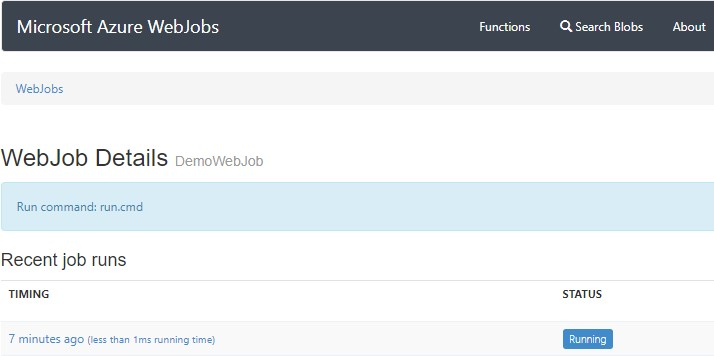
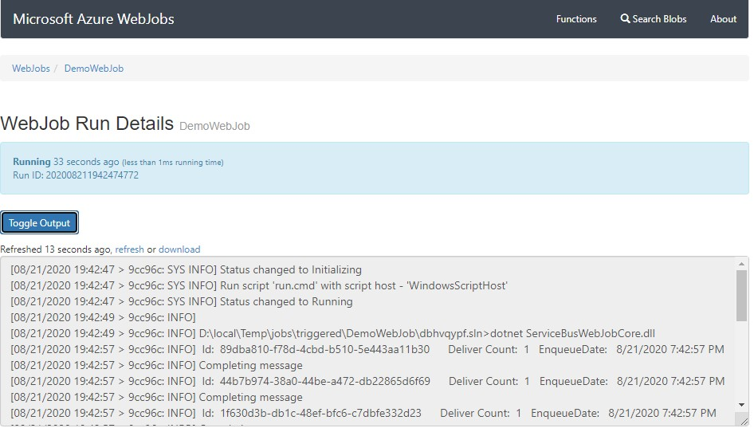
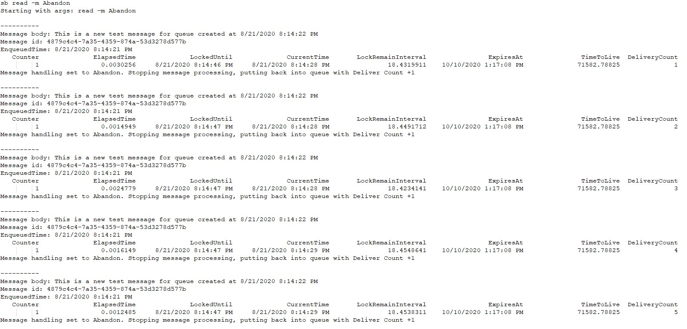
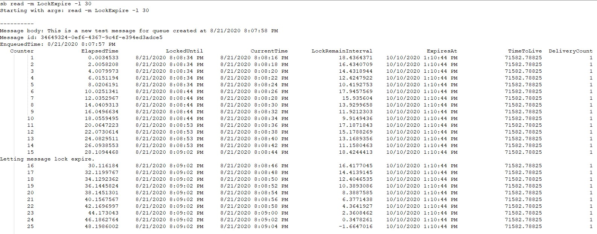

# Service Bus Example

## What's included

Example code for accessing using Azure Service Bus. Includes the following projects:

- **ServiceBusUtility** - A command line tool to send messages to and read messages from an Azure Service Bus Queue
  - `sb send --count <int> --wait 100` : Sends the specified number of messages to the service bus, waiting a specified number of milliseconds between each send
  - `sb read --messagehandling  <Abandon|Complete|DeadLetter|LockExpire> --lockrenew 60` : Reads messages from the Service Bus, with the specified handling of the message. 
- **ServiceBusWebJobCore** A .NET Core implementation of a Service Bus triggered web job.

## Setup

1. From a PowerShell command, run the `setup.ps1` script. This will:

   - Create the Azure App Service plan, App Service and Azure Service Bus services
   - Update the Azure App Service app settings configuration with the appropriate connection strings
   - Update the webjob project's `appsettings.json` file and the utility `app.confg` file with the appropriate connection strings
   - Perform a local build of both the utility and webjob projects
   - Publish the webjob project to the newly created Azure App Service

``` PowerShell
Connect-AzAccount
./SetUp.ps1 -resourceGroupName <resource group name> -resourceGroupLocation <Azure region> -serviceNamePrefix <6 characters>
```

----

## Running

After running the setup (above), you can send messages to the Service Bus by navigating to the output directory of the utility project `\ServiceBusExample\ServiceBusUtility\bin\Debug\netcoreapp3.1`

From here, try running the send command

``` bash
sb send --count 10

Starting with args: send -c 10
Loop 001: Sent message '1812e4a2-bd6e-4f6e-97f2-64523ff2ded5' to queue 'demoqueue'
Loop 002: Sent message '4596609c-8b47-4685-84ed-5e1dbf4522a9' to queue 'demoqueue'
Loop 003: Sent message '9fd59a8c-a7a4-46cc-a9d9-03c44ebfc61b' to queue 'demoqueue'
Loop 004: Sent message '5cfd2824-56bd-412b-b056-de524883ddfb' to queue 'demoqueue'
Loop 005: Sent message 'd14fee7c-3c88-4602-baad-9ff9b3f1adbe' to queue 'demoqueue'
Loop 006: Sent message '325c948f-ecba-4637-8af5-1351fb4d2fa4' to queue 'demoqueue'
Loop 007: Sent message '9daf0c44-bb3c-4ea2-be91-79180f90b22d' to queue 'demoqueue'
Loop 008: Sent message 'e8d4a14c-5898-494a-87f2-7361d9783996' to queue 'demoqueue'
Loop 009: Sent message '5b17e9d0-cc66-439b-8267-b09d0a531e3b' to queue 'demoqueue'
Loop 010: Sent message '71b8d368-5ab7-4612-a317-37d8e0d5c414' to queue 'demoqueue'
```

You now have messages in your queue and if the webjob is running, they should have been "processed"

In your browser, navigate to `https://<web app name>.scm.azurewebsites.net/azurejobs/#/jobs/triggered/DemoWebJob`, replacing `<web app name>` with the name of the app created by the setup scripts. This is the Kudu dashboard for your web job:



Here you should see that the job is running and by clicking on the link, you can get to the run logs:



----

## Experimenting

To experiment with different Service Bus message handling, you can leverage the utility project `read` command 

First, to make sure the webjob does not pick up your messages, you can either delete the webjob via the Azure portal, or terminate the process via the Kudu process explorer: `https://<web app name>.scm.azurewebsites.net/ProcessExplorer/`

Now, try send a message to the Service Bus via:

``` bash
sb send --count 1
```

### **Demonstrate "Abandon"**

Abandoned messages are put back into the queue with there delivery count incremented. Once the delivery count hits the limit set on the queue, it will be sent to the Dead Letter queue



### **Demonstrate "Lock Expiration"**

The default message lock time is an attribute that can be set on the queue. You can extend the default lock with your Queue client. The output below shows a default lock of 20 seconds, but a Queue client lock of 30 seconds.

You should notice that the actual lock time will likely be longer than the requested time (but it won't be shorter). Once the lock expires, the message will get requeued with its delivery count incremented by 1



